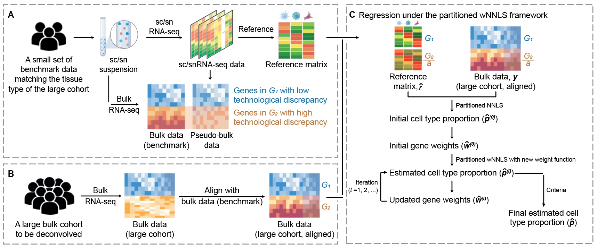

# DeMixSC for bulk RNA-seq deconvolution

DeMixSC is a generalizable framework designed to leverage a small benchmark dataset for bulk RNA-seq deconvolution.

Please refer to our **[accepted manuscript at Genome Research](https://genome.cshlp.org/content/early/2024/11/22/gr.278822.123.abstract)** for details.

## Overview

DeMixSC offers accurate cell-type deconvolution for large bulk RNA-seq datasets through a three-tier procedure:

1. **Adjustment**: DeMixSC uses a specially designed benchmark dataset to identify and adjust genes with high inter-platform discrepancy (**A**).

2. **Alignment**: DeMixSC aligns the large bulk cohort with the benchmark bulk data to generalize the inter-platform discrepancy (**B**).

3. **Deconvolution**: DeMixSC runs a refined weighted non-negative least square (wNNLS) framework iteratively for deconvolution  (**C**).

*Note*: DeMixSC requires a matched tissue type between the small benchmark dataset and the large targeted cohort.

<figure>
  
  <figcaption>Rescource: Workflow of DeMixSC (Guo et al. 2023, doi: https://doi.org/10.1101/2023.10.10.561733).</figcaption>
</figure>

## Getting Started

We provide a comprehensive, step-by-step **[TUTORIAL](https://wwylab.github.io/DeMixSC/)** for using DeMixSC to perform bulk transcriptomics cell-type deconvolution. This tutorial includes detailed examples and explanations to ensure you can effectively apply the framework to your own data.

Before diving into the tutorial, you will need to install the DeMixSC package and its dependencies.

## Installation and Setup

DeMixSC is implemented in `R`, and requires version 4.2.1 or higher. To get started, please ensure the following `R` packages are installed:

```r
# Install BiocManager if necessary
  if (!"BiocManager" %in% rownames(installed.packages())) {
    install.packages("BiocManager")
  }
  
# Install required pacakges
  BiocManager::install("sva")
  BiocManager::install("preprocessCore")
  install.packages("doParallel")
  install.packages("pbapply")
  install.packages("nnls")
```

Once the required packages are installed, you can install the latest DeMixSC directly from our GitHub repository:

```r
# Install devtools if necessary
  if (!"devtools" %in% rownames(installed.packages())) {
    install.packages('devtools')
  }

# Install our DeMixSC package
  devtools::install_github('wwylab/DeMixSC')
```

## License

This package is licensed under GNU Affero General Public License v3.0. See the LICENSE file for details. 

## Contact

For questions or comments about DeMixSC, please contact the package maintainers at Shuai Guo (<SGuo3@mdanderson.org>), Xiaoqian Liu (<xiaoqian.liu@ucr.edu>), and Ruonan Li (<RLi10@mdanderson.org>). If you find a bug or have a feature request, please submit an issue on the GitHub repository.

