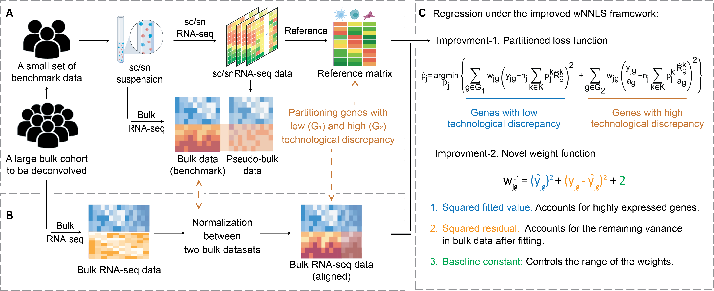

# DeMixSC for bulk RNA-seq deconvolution

DeMixSC is a generalizable framework designed to leverage single-cell sequencing and a small benchmark dataset for bulk RNA-seq deconvolution.
Please refer to our [preprint](https://www.biorxiv.org/content/10.1101/2023.10.10.561733v1) for details of DeMixSC.

# Framework overview
DeMixSC offers accurate cell-type deconvolution for large bulk RNA-seq datasets through a two-tier procedure.  

First, DeMixSC utilizes a specifically designed benchmark dataset to identify and adjust genes with high inter-platform discrepancies (Fig.1A). 

Second, to deconvolve a large unmatched bulk RNA-seq dataset, DeMixSC aligns it with the benchmark dataset (Fig.1B) and then employs a refined weighted non-negative least square (wNNLS) framework for deconvolution (Fig.1C).

Note: DeMixSC requires a matched tissue type between the small benchmark dataset and the large targeted cohort.

<figure>
  
  <figcaption>Rescource: Figure 1, Workflow of DeMixSC (Guo et al. 2023, doi: https://doi.org/10.1101/2023.10.10.561733).</figcaption>
</figure>

# Usage

DeMixSC is implemented in R. To use DeMixSC, first download the latest version of `DeMixSC` package from this GitHub page directly. 

After unzipping, the `DeMixSC-main` folder contains the required functions for preprocessing (in the R script `DeMixSC.preprocess.R`) and deconvolving (in the R script `DeMixSC.deconvolution.R`). Link these functions to your working directory as follows:

```r
# DeMixSC core functions
  source("./DeMixSC-main/DeMixSC.preprocess.R")
  source("./DeMixSC-main/DeMixSC.deconvolution.R")
```

Next, install the required packages for running DeMixSC as follows: 

```r
# List of required packages
  packages <- c("preprocessCore", "nnls", "doParallel", "sva", "devtools")
  
# Check and install the these packages.
  install_and_load <- function(package){
    if (!require(package, character.only = TRUE)) {
      install.packages(package, dependencies = TRUE)
      library(package, character.only = TRUE)
    }
  }
  
  lapply(packages, install_and_load)

# Required packages
  library("preprocessCore")
  library("nnls")
  library("doParallel")
  library("sva")
  library("devtools")
```

You can then use the provided functions to conduct the experimental analyses. We provide a [tutorial](link) on using DeMixSC for deconvolving a sample dataset. 


# License
This package is licensed under GNU Affero General Public License v3.0. See the LICENSE file for details. 

# Contact
For questions or comments about DeMixSC, please contact the package maintainers at Shuai Guo <SGuo3@mdanderson.org> and Xiaoqian Liu <XLiu31@mdanderson.org>. If you find a bug or have a feature request, please submit an issue on the GitHub repository.


